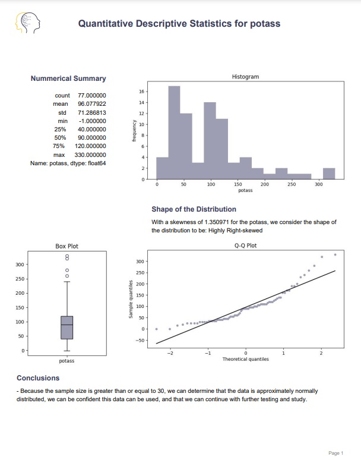

## Quantitative Descriptive Statistics PDF Report Creator by Dataplicada

This program helps data analysts understand ONLY the quantitative data they have. Some specific things this program does:

1. Get Numerical Summaries
2. Obtain the 5 Number Summary with a Box Plot
3. Determine the Shape and distribution of the data with Histogram & QQ Plot and helps the analyst make decisions to end up with a final conclusion of the descriptive statistics analysis.
4. Creates a professional looking PDF report

### Instructions

To use this program, you need to:

1. Add the csv file you want to analyze to the `datasets` folder
2. Run the `quantitative_descriptive_stats.py` program
3. Follow the instructions and answer the questions the program ask you
4. Review the graphs as they appear to determine the proper conclusions
5. Take a look at your report that is stored in the `reports` folder

### Important Notes

- All images generated are stored in the `images` folder
- All pdf reports are stored in the `reports` folder
- Images and reports are stored with the name of the csv file and of the variable (column) analyzed
- The datasets in the `test_datasets` folder are there to test the program
- You can test the program by running the `test_quantitative_descriptive_stats.py` (sometimes a test fails, but with one or two retries it should pass all tests).

### Required Technologies

You will need to install the following libraries:

- pandas
- matplotlib
- math
- scipy
- statsmodels
- fpdf
- webbrowser

### Contact

Felipe Valencia Clavijo & Dataplicada © - fevacla@byui.edu